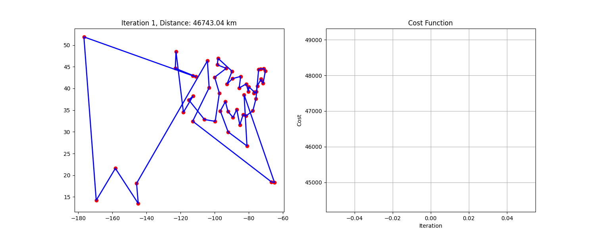

# ACO w optymalizacji kombinatorycznej (TSP)

## Streszczenie

Niniejszy raport przedstawia implementację metaheurystyki Ant Colony Optimization (ACO)  oraz ocenia jej przydatność do rozwiązania problemu komiwojażera (TSP) na instancji złożonej z 50 lotnisk, po jednym reprezentancie z każdego stanu USA. W raporcie omówiono: charakterystykę zbioru danych, formalne sformułowanie problemu, złożoność metod dokładnych, porównanie podejść MILP i metaheurystycznych, funkcję celu, zasadę działania algorytmu ACO oraz uzasadnienie wyboru tej metody.

---

## 1. Cel i zakres pracy

Celem pracy jest:

1. Prezentacja zbioru danych oraz sposobu jego przetworzenia.
2. Ograniczenia i przyjęte uproszczenia
3. Sformułowanie problemu komiwojażera dla 50 lotnisk jako instancji TSP.
4. Analiza złożoności obliczeniowej dokładnych metod rozwiązywania TSP.
5. Porównanie podejścia MILP z metaheurystyką ACO.
6. Szczegółowy opis funkcji celu.
7. Omówienie implementacji i działania algorytmu ACO.
8. Uzasadnienie wyboru ACO.

Zasięg raportu obejmuje omówienie głównych koncepcji oraz odniesienie do kodu źródłowego znajdującego się w repozytorium **czareek/ACO\_NMO**.

---

## 2. Zbiór danych

Zbiór „US Airports” autorstwa Nancy Al Aswad dostępny na platformie Kaggle zawiera dane o lotniskach komercyjnych w USA, w tym współrzędne geograficzne oraz statystyki ruchu lotniczego. W projekcie wykorzystano wyłącznie współrzędne geograficzne. Na potrzeby instancji TSP wybrano po jednym lotnisku z każdego stanu, kierując się kryterium relatywnej wielkości ruchu. W efekcie powstał gęsto połączony graf z 50 wierzchołkami przedstawiony za pomocą macierzy odległości. Odległości zostały przekształcone za pomocą formuły haversine tak, aby uwzględnić krzywiznę ziemi.

---

## 3. Problem komiwojażera (TSP)

Problem komiwojażera (TSP) polega na znalezieniu najkrótszej trasy odwiedzającej każde miasto dokładnie raz i powracającej do punktu startowego. Instancja obejmuje 50 węzłów, co sprawia, że znalezienie dokładnego rozwiązania jest obliczeniowo wymagające. Liczba wszystkich możliwych permutacji trasy wynosi 50!\~3,04x10^64, co jest wielokrotnie większe niż szacowana liczba atomów na Ziemi (ok. 1,33	x10^50 ), podkreślając ekstremalną skalę problemu. 

---

## 4. Ograniczenia i przyjęte uproszczenia

W rzeczywistości oparcie modelu na odległościach pomiędzy lotniskami w lini prostej ( uwzględniając krzywiznę ziemi za pomocą formuły haversine ) jest błędne z wielu względów np. sam fakt, że odległość między lotniskiem nie jest dystnasem który przebędzie samolot:
- Samoloty mogą wykorzystywać wiatry w jet streamie, aby zwiększyć swoją prędkość w locie na wschód.
- Samoloty mogą omijać przelot nad pewnymi terenami np. baz wojskowych

Dużym czynnikiem szczególnie przy krótkich lotach może być czas startu i lądowania.
Jako wagi w tym grafie i "odległości" w macierzy lepiej sprawdziłyby się czasy przelotów. Wtedy można by uwzględnić również czasy odlotów i przylotów oraz oczekiwania na lotnisku. Tak jak w przypadku odległości łatwo można za pomocą percepcji wzrokowej ocenić jakość rozwiązania, tak przy uwzględnianieniu czasów, czasów oczekiwań na odlot, ograniczeń takich jak czas presiadki jest to niemożliwe do wizualnego ocenienia. Problem wtedy nie byłby klasy TSP tylko połączeniem problemu trasowania i harmonogramowania. Kolejnym problemem z jakim zmagałby sie ten model to możliwość losowych opóźnień które też wartoby było uwzględnić w modelu.   

---

## 5. Złożoność metod dokładnych w problemie TSP

1. **Przegląd wszystkich permutacji** – złożoność O(n!), co dla dużych instancji, jak  n=50 jest w praktyce niewykonalne, gdyż wymagany do tego czas obliczeń przekracza jakiekolwiek racjonalne ograniczenia, oczekiwania nałożone np. przez biznes.
2. **Algorytm Held–Karp** – złożoność czasowa Θ(2^n · n^2) i pamięciowa Θ(n · 2^n), co również przekracza możliwości praktyczne dla n=50.

Brak efektywnego  algorytmu działającego w czasie wielomianowym i  gwarantującego optymalne rozwiązanie czyni metody dokładne niepraktycznymi w zastosowaniach o większej skali.

---

## 6. Modele MILP versus metaheurystyki

### 6.1 Formulacja MILP

Problem TSP można zapisać jako program liniowy z całkowitymi zmiennymi (MILP) z użyciem nierówności subtour elimination (np. Miller–Tucker–Zemlin) oraz technik branch-and-cut. Metoda gwarantuje znalezienie rozwiązania optymalnego jeżeli takie istnieje, lecz generuje dużą liczbę ograniczeń i podproblemów, co skutkuje wysokim obciążeniem zasobów obliczeniowych i stosunkowo długim czasem obliczeń ( czas obliczeń zależy od instancji porblemu ,ilości nałożonych ograniczeń, liczby zmiennych - w tym szczególnie tych z ograniczeniem całkowitości oraz wydajności solvera ).

### 6.2 Metaheurystyki

Metaheurystyki, takie jak ACO, Simulated Annealing czy Genetic Algorithm, przeszukują przestrzeń rozwiązań przybliżonymi metodami w czasie wielomianowym. Nie gwarantują znalezienia globalnego optimum, ale oferują szybkie uzyskanie tras o jakości bliskiej optymalnej. Zaletą metaheurystyk jest to, że nie są one specyficzne do problemu, mogą być dostosowane do konkretnego rodzaju problemu ale przez to jednocześnie wymagają większych zdolności do implementacji w bardziej złożonych problemach, z większa liczbą zmiennych i ograniczeń.

**Trade-offy**:

* **MILP**: gwarancja optymalności; wysoki koszt obliczeniowy; utrudniona skalowalność; konieczność dokładnego sformułowania matematycznych ograniczeń.
* **Metaheurystyki**: elastyczność i skalowalność; skrócenie czasu obliczeń; konieczność strojenia hiperparametrów; brak gwarancji znalezienia globalnego optimum, potrzeba dostosowania algorytmu do problemu np. w przypadku dodania nowego ograniczenia

---

## 7. Funkcja celu

Dla permutacji trasy $\pi = (\pi_1,\dots,\pi_n)$ funkcja celu ma postać:

$$
\min\; C(\pi) = \sum_{i=1}^{n-1} d(\pi_i,\pi_{i+1}) + d(\pi_n,\pi_1),
$$

gdzie $d(i,j)$ to odległość między węzłami $i$ i $j$.

---

## 8. Implementacja ACO

W repozytorium **czareek/ACO\_NMO** znajduje się implementacja algorytmu Ant Colony Optimization, która realizuje heurystyczne przeszukiwanie grafu 50 lotnisk opisane następującymi etapami:

1. **Ogólna idea**
   Metaheurystyka ACO symuluje zachowania kolonii mrówek, które oznaczają preferowane ścieżki feromonami. W tej implementacji każda krawędź między lotniskami przechowuje poziom feromonów $\tau_{ij}$ , a informacja heurystyczna $\eta_{ij} = 1/d(i,j)$ odzwierciedla dystans. Mrówki "wybierają" kolejne lotnisko z prawdopodobieństwem:

   $$
   p_{ij} = \frac{\tau_{ij}^\alpha \,\eta_{ij}^\beta}{\sum_{k\in U_i} \tau_{ik}^\alpha \,\eta_{ik}^\beta},
   $$

   gdzie U to zbiór jeszcze nieodwiedzonych wierzchołków.

2. **Hiperparametry**
   Kluczowe parametry algorytmu to:

   * **α** – wpływ śladu feromonowego na wybór kolejnego węzła;
   * **β** – waga informacji heurystycznej (odległości między węzłami);
   * **ρ** – współczynnik odparowania feromonów, określający tempo zanikania śladu;
   * **m** – liczba mrówek działających równolegle w każdej iteracji;
   * **n\_best** – liczba najlepszych tras wybranych do depozycji feromonów;
   * **iteracje** – maksymalna liczba iteracji algorytmu;
   * **patience** – dopuszczalna liczba kolejnych iteracji bez poprawy, po której algorytm kończy działanie.

3. **Mechanizm działania**
   Algorytm przebiega w cyklu iteracji, z następującymi krokami:

   1. **Budowa tras** – każda z m mrówek konstruuje pełny cykl, wybierając lotniska wg rozkładu $p_{ij}$.
   2. **Ocena tras** – obliczana jest długość każdej ścieżki:

      $$
      C = \sum_{i=1}^{n} d(i, j),
      $$

      gdzie suma przebiega po kolejnych krawędziach ścieżki.
   3. **Odparowanie feromonów** – na wszystkich krawędziach następuje redukcja feromonów:

      $$
      \tau_{ij} \gets (1 - \rho) \,\tau_{ij}.
      $$
   4. **Depozycja feromonów** – najlepsze n\_best ścieżki wzmacniają feromony:

      $$
      \tau_{ij} \gets \tau_{ij} + \sum_{\ell=1}^{n_{\text{best}}} \frac{1}{C_{\ell}}.
      $$
   5. **Wczesne zatrzymanie** – jeżeli przez kolejne #patience iteracji nie nastąpi poprawa, algorytm przerywa działanie.

## 8. Podsumowanie i wnioski

Implementacja ACO stanowi efektywne narzędzie do przybliżonego rozwiązania problemu komiwojażera na instancji z 50 lotnisk USA. Metaheurystyka oferuje atrakcyjny kompromis między jakością rozwiązania a wymaganiami zasobów obliczeniowych, co czyni ją praktyczną alternatywą dla metod dokładnych MILP w zastosowaniach logistycznych i planowaniu tras, szczególnie w przypadku, gdy:

* czas na obliczenia również jest warunkiem ograniczającym w praktycznym zastosowaniu modelu. 
* decyzja podjęta na podstawie wyników nie jest decyzją strategiczną o długofalowych skutkach, gdzie znalezienie rozwiązania optymalnego mogło by być uzasadnione.

